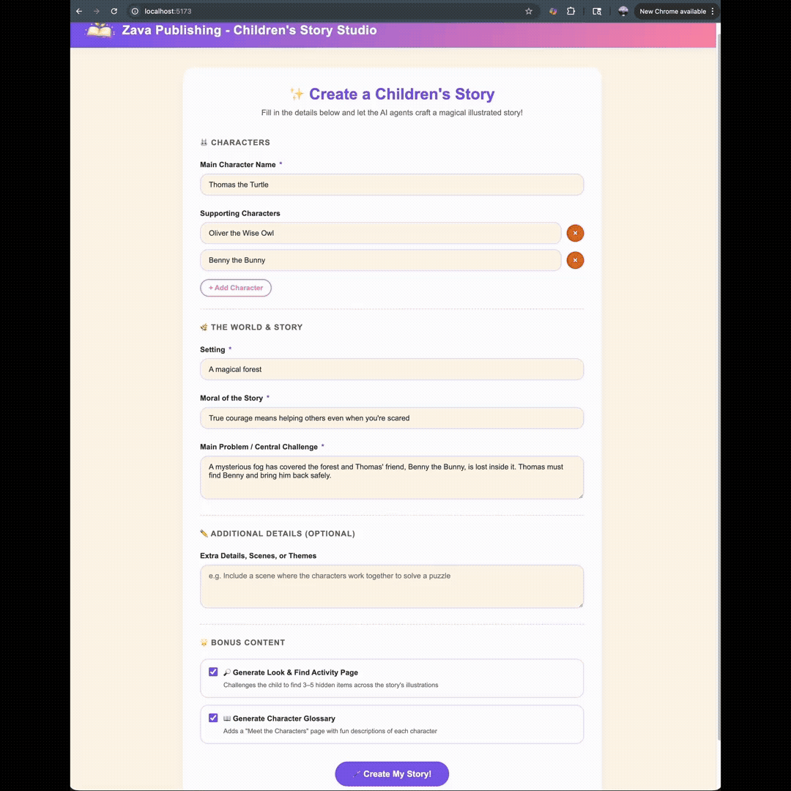

# Children's Story Studio — Multi-Agent Orchestration

**Children's Story Studio** is a full-stack application that uses [Microsoft Agent Framework](https://github.com/microsoft/agent-framework) to orchestrate multiple AI agents that collaboratively generate illustrated children's stories. It is designed to serve two purposes:

1. **Multi-Agent Orchestration Example** — A real-world reference implementation showing how to build agent workflows with Microsoft Agent Framework, including conditional branching, revision loops, and real-time progress streaming.
2. **Engineering Sandbox** — A well-structured starting point that engineers can clone, experiment with, and extend with new agents and multi-modal AI capabilities.



## Branches in this Repo

This repository is structured around a hands-on workshop. Pick a branch based on what you want to do:

| Branch | What's in it | When to use it |
| --- | --- | --- |
| **`main`** | A **minimal version of the app** with the core multi-agent workflow only. Activity-page agents, text-to-speech, Wikipedia RAG, OpenTelemetry, and the art-style picker are deliberately left out. | The **workshop starting point**. Clone this branch and use **GitHub Copilot** (and the **Copilot CLI**) to build the additional features yourself by following the [Guides](#guides) below. |
| **`all-features`** | The **fully-built reference application** with every feature from every guide already implemented. | When you want to see the finished product, run a polished demo, or compare your workshop output against a working reference. |

Either branch can be deployed to Azure with a single `azd up` — see [Deploying to Azure](docs/08-deploying-to-azure.md).

## How It Works

A user fills in story details (characters, setting, moral, etc.) and the application orchestrates **five specialized AI agents** through a coordinated workflow to produce a fully illustrated children's storybook — complete with cover art, per-page illustrations, and narrative text — all streamed to the browser in real time.

```
Orchestrator → StoryArchitect → ArtDirector → StoryReviewer → Decision
    ↑                                                             │
    └──────────── RevisionSignal (max 2 rounds) ──────────────────┘
```

## Quick Start

1. **Get running locally in minutes** — [Local Quickstart](docs/00-local-quickstart.md)
2. **(Deeper dive) Prerequisites & Setup** — [Prerequisites & Environment Setup](docs/01-prerequisites-and-setup.md)
3. **Understand the architecture** — [Architecture Overview](docs/02-architecture-overview.md)
4. **Walk through the demo flow** — [Running the Demo](docs/03-running-the-demo.md)
5. **Deploy to Azure** — [Deploying to Azure](docs/08-deploying-to-azure.md)

## Guides

These step-by-step walkthroughs guide you through extending the base application with new capabilities using **GitHub Copilot**. Each guide demonstrates a different pattern for expanding multi-agent workflows and integrating additional AI modalities.

| Guide | What You'll Build | Key Concepts |
|---|---|---|
| [Adding Activity Page Agents](docs/04-guide-activity-page-agents.md) | Look & Find activity page + Character Glossary page appended to the storybook | Fan-out / fan-in agent patterns, new agent creation, conditional workflow paths, UI extensions |
| [Adding Text-to-Speech](docs/05-guide-tts.md) | Play button on each page that streams Azure AI Speech narration | Multi-modal AI (text → speech), new API endpoints, streaming audio, `DefaultAzureCredential` |
| [Adding Wikipedia RAG](docs/06-guide-wikipedia-rag.md) | Wikipedia-powered story generation with Full and Influence modes | Retrieval-Augmented Generation (RAG), external API integration, prompt enrichment, dynamic UI modes |
| [Adding OTEL Observability (AI Toolkit)](docs/07.a-guide-otel-observability-ai-toolkit.md) | Distributed tracing across all agents, viewable in VS Code via AI Toolkit | OpenTelemetry, distributed tracing, AI Toolkit trace viewer, prompt inspection |
| [Adding OTEL Observability (Aspire)](docs/07.b-guide-otel-observability-aspire.md) | Distributed tracing across all agents, viewable in the Aspire Dashboard | OpenTelemetry, distributed tracing, OTLP export, .NET Aspire Dashboard, Application Insights |
| [Hosting the Agents in Microsoft Foundry](docs/09-guide-foundry-hosted-agents.md) | Switch every chat agent in the workflow from in-process to a Foundry-hosted agent with one env var; provision via an idempotent script | Microsoft Foundry agents, `FoundryAgent`, idempotent provisioning, source-of-truth contract |
| [Running LLM Evals Locally (AI Toolkit / Foundry Toolkit)](docs/10.a-guide-evals-ai-toolkit.md) | Score the agents' outputs from inside VS Code using the Foundry Toolkit extension, with the sample dataset shipped in `evals/` and a custom "Moral Honored" evaluator | LLM evaluation, JSONL datasets, built-in evaluators (Coherence/Fluency/Similarity), custom prompt-based evaluators |
| [Running Cloud Evals on Foundry-Hosted Agents](docs/10.b-guide-evals-foundry.md) | Run evaluations in the Microsoft Foundry portal against your provisioned hosted agents, including continuous evaluation against production traces | Foundry portal evals, agent target evaluations, continuous evaluation, Application Insights monitoring |

> **Approach:** Each guide walks you through using GitHub Copilot in **Plan mode** (with Claude Opus, or your preferred model) to design the implementation, then **Agent mode** (with Claude Sonnet, or your preferred model) to execute it. The goal is to experience how an AI engineer would use Copilot to extend an existing agent-based application.

## Documentation

| Document | Description |
|---|---|
| [Local Quickstart](docs/00-local-quickstart.md) | The shortest path to running the app locally |
| [Prerequisites & Environment Setup](docs/01-prerequisites-and-setup.md) | Tools, Azure resources, environment configuration, and local setup |
| [Architecture Overview](docs/02-architecture-overview.md) | System design, agent descriptions, workflow graph, SSE streaming, and data flow |
| [Running the Demo](docs/03-running-the-demo.md) | Step-by-step instructions for running the app and demo talking points |
| [Guide: Activity Page Agents](docs/04-guide-activity-page-agents.md) | Extend the workflow with Look & Find and Character Glossary agents |
| [Guide: Text-to-Speech](docs/05-guide-tts.md) | Add Azure AI Speech narration to every story page |
| [Guide: Wikipedia RAG](docs/06-guide-wikipedia-rag.md) | Add Wikipedia-powered story generation with retrieval-augmented context |
| [Guide: OTEL Observability (AI Toolkit)](docs/07.a-guide-otel-observability-ai-toolkit.md) | Add OpenTelemetry tracing viewable in VS Code via AI Toolkit |
| [Guide: OTEL Observability (Aspire)](docs/07.b-guide-otel-observability-aspire.md) | Add OpenTelemetry tracing viewable in the .NET Aspire Dashboard |
| [Deploying to Azure](docs/08-deploying-to-azure.md) | One-command `azd up` deploy to Azure Container Apps, including optional Microsoft Entra sign-in |
| [Guide: Foundry-Hosted Agents](docs/09-guide-foundry-hosted-agents.md) | Run the chat agents as Microsoft Foundry-hosted agents instead of in-process; provision via an idempotent script |
| [Guide: LLM Evals — AI Toolkit / Foundry Toolkit (local)](docs/10.a-guide-evals-ai-toolkit.md) | Run offline LLM evaluations against the agents inside VS Code using the Foundry Toolkit extension |
| [Guide: LLM Evals — Microsoft Foundry portal (cloud)](docs/10.b-guide-evals-foundry.md) | Run cloud evaluations in the Foundry portal against your hosted agents, with continuous-eval and CI options |

## License

This project is provided as an example for demonstration and experimentation purposes.
